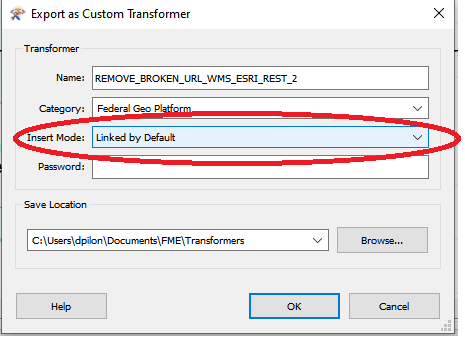
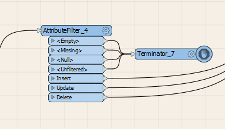

# Bonne Pratiques FME

Ce document contient une liste de bonne pratiques à utiliser lors du développement de *Workbench* ou de *Custom Transformer*.  Le suivi de ces directives facilitera la maintenance en assurant un homogénéité du code écrit par les différents développeurs.

Note importante: Ce document de bonne pratiques FME est en mode ébauche, les membres de l'équipe sont encouragés à développer de nouvelles *bonnes pratiques FME* ou de bonifier des *bonne pratiques FME* existentes qui seront partagées au sein de l'équipe et consignées dans le site web d'équipe.   

Ce document adresse les éléments de *bonnes pratiques FME* suivants:

 - [Création de custom transformer](#Création-de-custom-transformer)
 - [Documentation](#Documentation)
 - [Enregistrement entrant et sortant](#Enregistrement-entrant-et-sortant)
 - [Gestion des attributs](#Gestion-des-attributs)
 - [Hardcoding](#Hardcoding)
 - [Python](#Python)
   - [Installation de Packages](#Installation-de-packages)
   - [Packages requis](#Packages-requis)
   - [Gestion des sources Python](#Gestion-des-sources-Python)
   - [Débuggage en Python](#Débuggage-en-python)
 - [Nom du transformer](#Nom-du-transformer)
 - [Patron de conception](#Patron-de-conception)
   - [Traitement d'une liste](#Traitement-d'une-liste)
 - [Résillience](#Résillience)
 - [Terminator](#Terminator)
 - [Tester ou TestFilter](#Tester-ou-TestFilter)

# Création de custom transformer

Le *custom transformers* est une composante essentielle pour écrire du code réutilisable et développer des *workbench* qui sont plus facilement lisibles et maintenables.  Le *custom transformer* permet d'encapsuler (d'isoler) du code qui est un concept important de la programmation moderne.

La compagnie FME offre plusieurs [tutorials](https://docs.safe.com/fme/html/FME_Desktop_Documentation/FME_Workbench/Workbench/custom_transformer_creating.htm) et [vidéos](https://www.youtube.com/watch?v=oQ_SeW0sdEM&ab_channel=MarkIreland) montrant comment développer des *custom transformer*.  A ces bonnes pratiques, il faut ajouter les particularités suivantes qui touchent l'utilisation des *custom transformer* dans notre organisation.

  - Lorsque l'on crée un *custom transformer* avec la commande *Export as Custom Transformer* vous devez toujours vous assurez que l'option *Insert mode* est **Linked by default** ce qui permet de garder un lien vers le *custom transformer* et non pas de l'incorporer dans votre code.  De cette façon si le *custom transformer* est modifié vous aurez toujours un lien vers la version la plus récente.

  - Lorsque le *custom transformer* est exporté vous devez ajusté le mode d'exécution dans Python.  Pour ce faire, dans le panneau *Navigator*, *Transformer Parameters* > *Scripting* > *Python compatibility* mettre la valeur **Python 3.7+**

# Documentation

Toujours documenter les *transformer* et *custom transformer* selon la [procédure de documentation](Documentation%20FME.md) afin d'assurer une homogénéité dans le code en plus de maximiser sa lisibilité.
 

# Enregistrement entrant et sortant

Dans un *custom transformer* le nombre d'enregistrement entrant devrait habituellement être égal au nombre d'enregistrement sortant.  Si vous avez des enregistrements problématique, il est préférable d'avoir un ou plusieurs ports de sortie dédiés pour gérer ces cas (ex.: *Error* ou *Unprocessable*) afin de laisser au *workbench* ou *custom transformer* appelant la décision de comment gérer ces cas problématiques: en les enregistrant dans un fichier de log ou en appelant un *Terminator* ou autre moyen de gestion des cas problématiques.

# Gestion des attributs

Le traitment des collections d'enregistrements de métadonnées des différentes provinces utilise plusieurs centaines d'attributs FME et de listes FME en plus de ceux qui sont créés par les différents *transformer* et *custom transformer* de vos *workbench*.  En plus de saturer le FME Data Inspector et de rendre l'interprétation des résultats plus difficile, les attributs et listes sont de grands consommateurs de ressources pour FME (mémoire et CPU).  Afin de mieux gérer les attributs tous les *custom transformer* doivent se conformer aux directives suivantes:
  * Utiliser le *custom transformer* ATTRIBUTE_UNEXPOSER à la fin de l'exécution d'un *custom transformer* afin qu'aucun n'attribut ne soit exposé;
  * Utilisé le *transformer* *AttributeExposer* au début de votre *custom transformer* afin d'exposer uniquement les attributs nécessaires à votre traitement afin d'en faciliter la lecture, le débuggage et optimiser l'utilisation des ressources;
  * Utiliser le *AttributeRemover* afin d'enlever tous les attributs et listes temporaires et/ou qui ne sont plus utiles à votre traitement subséquents afin d'en faciliter la lecture, le débuggage et optimiser l'utilisation des ressources.

# Hardcoding

Le *hardcoding* est une pratique de développement logiciel où les données sont directement écrite dans le code.  Cette pratique tend à créer du code moins générique qu'il faut constamment modifier pour l'adapter à de nouvelles situations (ex.: prise en charge de nouvelles provinces).  Le *hardcoding* est à éviter à tout prix.  L'utilisation de fichiers de configuration et de *publish parameters* est encouragée afin d'éviter les problèmes engendrés par le *hardcoding*.

C'est au développeur d'identifier les situations potentielles de *hardcoding* et de choisir la meilleure stratégie d'évitement.

   - [Installation de Packages](#Installation-de-packages)
   - [Packages requis](#Packages-requis)
   - [Gestion des sources](#Gestion-des-sources)
   - [Debuggage en Python](#Debuggage-en-python)

# Python 

Cette section décrit les bonnes pratiques relatives à l'utilisation de Python dans FME

## Installation de packages

Il est possible d'étendre les possibilités de Python dans FME en installant des package supplémentaires.  Par contre, on doit passer par FME pour installer ces packages car dans l'environnement FME les programmes Python sont exécutés par FME.

Pour installer un package Python qui sera accessible par tous les environnement Python (3.5, 3.6, 3.7, 3.8, ...) de FME utiliser la commande suivante (où *&lt;user&gt;* représente votre nom d'usager):
  - fme.exe python -m pip install *<package_name>* --target C:\Users\\*&lt;user&gt;*\Documents\FME\Plugins\Python

Pour installer un package Python qui sera accessible par un environnement Python spécifique (3.5 ou 3.6 ou 3.7 ou  3.8 ou ...) utiliser la commande suivante:
  - fme.exe python -m pip install <package_name> --target C:\Users\\*&lt;user&gt;*\Documents\FME\Plugins\Python\python37

Note: La commande précédente installera un package dans l'environnement Python 3.7 uniquement.

Se référer à la [documentation FME](https://docs.safe.com/fme/html/FME_Desktop_Documentation/FME_Workbench/Workbench/Installing-Python-Packages.htm) pour plus d'information pour installer des package python.

## Packages requis

L'installation des package suivants est requis pour la transformation des métadonnées provinciales et territoriales:

  - PyYAML: Pour convertir des fichiers YAML
    - Installation: fme.exe python -m pip install PyYAML --target C:\Users\\*&lt;user&gt;*\Documents\FME\Plugins\Python

## Gestion des sources Python

Il existe deux solutions pour gérer le code source Python dans l'environnement FME.  Premièrement on peut laisser le code source directement dans les différents *PythonCaller*; ou deuxièmement on peut placer le code source python dans un répertoire centralisé visible par FME et y accécer via la commande *import*.  Les deux solutions ne sont pas incompatibles, si la première solution est la plus simple à implanter; la deuxième permet d'utiliser des outils de débuggage mais aussi de centraliser des utilitaires qui peuvent alors être partager entre les différents *PythonCaller*.

Une solution mixte est aussi préconisée, si votre *PythonCaller* contient peu de lignes de codes, il est préconisé de laisser le code source dans les *PythonCaller* alors que si le *PythonCaller* contient beaucoup de lignes de codes alors la solution de placer le code source dans un répertoire centrailisé est préconisée. 

Les sources Python doivent être placés dans le répertoire '..\fgp-metadata-proxy\FME_files\python\' les sources sont alors organisés par répertoire selon le nom du *CustomTransformer* dans lequel le code source se trouve.  Par exemple, le code source Python associé au *Custom Transformer*LOOKUP_TABLE_READER se trouve dans le répertoire '..\fgp-metadata-proxy\FME_files\python\LOOK_UP_TABLE_READER'.  Les utilitaires doivent être placés à la racine du répertoire des sources Python dans le fichier *utils.py*

Finalement, Il faut modifier le PYTHONPATH pour permettre à FME de "retrouver" les sources Python lors de l'exécution.  Dans l'éditeur des variables d'environnement pour votre compte (Edit Environment Variable for your Account) vous devez ajouter le chemin '..\fgp-metadata-proxy\FME_files\python\' à la variable d'environnement PYTHONPATH.  Si la variable d'environnement PYTHONPATH n'existe pas vous devez la créer.

## Débuggage en python

Le débuggage des *PythonCaller* peut vite devenir très laborieux. La seule façon de faire du débuggage étant de placer des commandes *print* dans le code et d'examiner le log produit par FME.

L'outil web-pdb est un outil de débugage minimaliste qui permet de débugger des *PythonCaller* en exécutant le code pas à pas et en examinant les variibles locales et globales.  Cet outil est moins puissant que d'autres outils de debuggage à distance tel que PyCharm, Eclipse ou LiClipse mais il n'y a pas d'autres applications à installer et la configuration est minimaliste.

Pour debugger avec web-pdb vous devez installer le package web-pdb dans l'environnement Python de FME avec la commande suivante:

  - fme.exe python -m pip install web-pdb --target C:\Users\\*&lt;user&gt;*\Documents\FME\Plugins\Python

Vous devez placer votre code Python dans l'environnement des répertoires Python (sinon web-pdb ne pourra pas voir le code qui s'exécute)

Vous devez placer la commande suivante dans votre code Python à l'endroit où vous voulez que l'exécution s'arrête

`import web_pdb; web_pdb.set_trace()`

Finalement, vous exécutez votre workbench FME et lorsque que FME exécute la commande: `import web_pdb; web_pdb.set_trace()`; l'exécution s'arrête et FME affiche le message suivant dans le log:

`CRITICAL:root:Web-PDB: starting web-server on L-SHE-A147764:5555...`

Vous devez alors ouvrir une fureteur internet (Chrome ou autre) et taper la commande suivante

`localhost:5555`

Vous pouvez alors contrôler l'exécution du *PythonCaller* dans Chrome; une fois l'exécution du Python terminée vous pouvez retourner dans l'environnement FME pour visualiser les résultats de l'exécution.

Plus de détails sur web-pdb sont disponibles dans le [répertoire GitHub de web-pdb](https://github.com/romanvm/python-web-pdb)

# Nom du transformer

Toujours conserver le nom du *transformer* tel que donné par FME.  Si vous avez plus d'un *transformer* du même type dans votre *workbench* alors ajouter un suffixe numérique (ex pour le *transformer* Tester: Tester, Tester_1, Tester_2, ...).  Conserver le nom du *transformer* original permet d'identifier plus rapidement le type de *transformer* employé.  Si un nom plus représentatif vous semble important alors privilégier une annotation sur le *transformer*. 

# Patron de conception

Les patrons de conception décrivent des procédés de conception généraux et permettent en conséquence de capitaliser l'expérience appliquée à la conception de logiciel. Ils ont une influence sur l'architecture logicielle d'un système informatique en accélérant le développement et en assurant une meilleure homogénéité du code.

D'une manière analogue à un motif de conception en architecture, le patron de conception décrit les grandes lignes d'une solution, qui peuvent ensuite être modifiées et adaptées en fonction des besoins.

Vous trouverez ci-dessous une liste de patron de conception adaptée au logiciel FME de Safe Software.

Des exemples FME de patron de conception sont disponibles dans le répertoire [.../doc/patron_conception](patron_conception)

## Traitement d'une liste

Bien que le logiciel FME soit capable de gérer des listes d'attributs, il est souvent difficile de manipuler et d'éditer facilement le contenu d'une liste dans FME.  Le patron de conception *Traitement d'une liste* permet d'exploser le contenu d'une liste, d'avoir accès directement aux attributs (sans avoir à gérer les indices d'une liste) et de reconstruire la liste. 

La figure ci-dessous décrit le patron de conception *Traitement d'une liste*. 

# Résillience

Le traitement des collections d'enregistrements de métadonnées de l'environnement des provinces et territoires (P/T) à celui du gouvernment fédéral se fait par traitment en lot (via *FME Server*).  Il est donc primordial que tous les *workbench* qui traitent les différentes P/T soient très résillients aux problèmes.  Si un ou plusieurs enregistrments de métadonnées ne peuvent pas être traduits car ces derniers contiennent un ou plusieurs cas particuliers qui ne sont pas pris en compte, il faut alors rejeter ce ou ces enregistrments, laisser une trace du problème dans un fichier log et traiter tous les autres enregistrements que le workbench est capable de manipuler.  Dans ce type de condition, il ne faut pas utiliser de *Terminator* qui ferait arrêter abruptement l'exécution du programme. 

**C'est au développeur de trouver la juste balance entre quand utiliser le *Terminator* (faire terminer abruptement un programme) car un *workbench* est dans un état instable et quand un *workbench* est incapable de traîter un enregistrement de métadonnées et ce dernier doit simplement être rejeté.**

# Terminator

Le *Terminator* est un *transformer* qui arrête abruptement l'exécution du *workbench* lorsqu'il est activé.  Il est utilisé généralement pour détecté des situations non valides.  Le *terminator* devrait toujours être utilisé dans le cas de *transformer* lorsqu'une situation inattendue survient mais aussi dans le cas de *transformer* qui possèdent plusieurs ports de sortie qui ne devraient pas être utilisé normalement. Dans de tels cas les ports de sortie *non utilisés* devraient être reliés à un *Terminator* de façon à déceler ces cas dans le code (voir figure ci-dessous).

Le *Terminator* offre aussi la possibilité d'afficher un texte lorsqu'il est activé.  Le texte devrait toujours être représentatif de la raison pourquoi le *Terminator* est activé (ex.: *Invalid attribute value for ID*) et éviter les formalutation trop générique (ex.: *Translation failed...*)

# Tester ou TestFilter

Les *transformer* *Tester* et *TestFilter* offre des capacités similaires pour tester des attributs et aiguiller l'exécution du programme.  Par contre, le transformer *TestFilter* offre les avantages suivants: 
  - Permet de par sa structure de fusionner plusieurs *transformer* *Tester* en un seul *transformer* *TestFilter* ce qui allège l'espace de travail; 
  - Permet d'utiliser plusieurs ports de sortie comme un outil *case* ou *switch* alors que *tester* n'offre que 2 ports de sortie (*Passed/Failed*);
  - Offre la possibilité de nommer les ports de sortie ce qui permet souvent d'autodocumenter le *tranformer*
  - Offre la possibilité d'avoir un port de sortie spécial (ex.: *Unfiltered*) pour gérer les cas non traités.  Vous pouvez alors utiliser un *Terminator* pour gérer tous ces cas problématiques.

En résumé, utiliser *Tester* pour des tests binaires (True|False) qui conviennent bien à leur port de sortie (*Passed/Failed*). Privilégié *TestFilter* pour les autres cas pour diminuer le nombre de transformers et augmenter la lisibilité.
