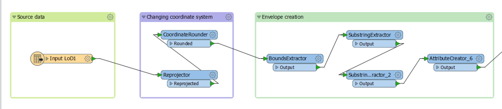
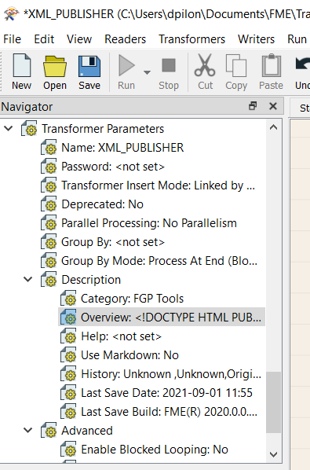
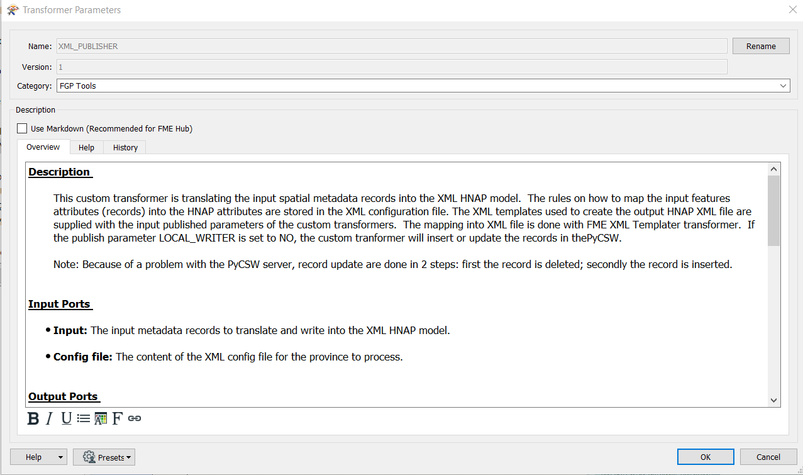
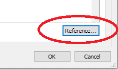

# Documentation FME

Les directives de documentation contenues dans ce document ont pout but d'assurer une homogénéité dans le code produit par les différents membres de l'équipes en plus de maximiser la lisibilité, l'usage et la maintenance.

Ce document adresse les éléments de documentation suivants:

 - [Annotation](#Annotation)
 - [Bookmark](#Bookmark)
 - [Bookmark imbriqué](#Bookmark-imbriqué)
 - [Description](#Description)

# Annotation

L'annonations est l'élément de base de la documentation dans FME.  N'hésitez pas à ajouter une annotation à pratiquemment tous vos *transformers* dans votre *workbench* ou *custom transformer*.  Ce qui est trivial lorsqu'on écrit du code aujourd'hui peut devenir moins trivial pour une autre personne ou pour vous même dans quelques semaines.  

De bonnes annotations permettent aussi de suivre et comprendre plus facilement le déroulement d'un *workbench* ou d'un *custom transformer* sans avoir à toujours cliquer dans les différentes boîtes pour les ouvrir et en comprendre le comportement.  Pour des annotation plus complexes, il est possible de placer des hyper liens et de changer le style du texte.

# Bookmark

Le *bookmark* (signet) est un élément visuel puissant qui permet de regrouper ensemble des *transformers* qui forment une unité de traitement.  Les *bookmarks* permettent de simuler des sous-routines.  Vous devriez toujours ajouter une courte phrase qui résume ce qui s'exécute dans le *bookmark*.  Vous pouvez aussi donner une couleur à votre *bookmark*, ce qui permet de les localiser plus rapidement et d'organiser votre espace de travail.

Les *bookmark* jouent un rôle important dans FME pour plusieurs raisons :
  * Comme marqueur pour un accès rapide à certaines zones de votre *workbench* ou *custom transformer*;
  * Pour diviser un espace de travail en différentes sections clairement marquées;
  * Pour organise un *workbench* ou *custom transformer* afin que vous puissiez déplacer plusieurs *transformers* en même temps;
  * Pour facilite la gestion des grands espace de travail en réduisant (*collapse*) les *transformer* qui sont placés dans en *bookmark*.

La figure ci-sessous montre un exemple d'utilisation de *bookmark* pour diviser l'espace de travail et mettre en relief les différentes tâches effectuées:

# Bookmark imbriqué

Il est possible d'imbriquer des *bookmark* les uns dans les autres.  ce qui permet d'ajouter une dimension supplémentaire dans le regroupement de tâches similaires dans un espace de travail volumineux.

# Description

Tous les *workbench* et *custom transformer* doivent être documentés.  L'application FME offre des outils intégrés qui facilite la documentation.  On retrouve ces outils dans la fenêtre Navigator sous l'onglet Transformer Parameters > Description (voir image cidessous)

Cliquer sur Overview et la fenêtre ci-dessous va apparaître:

Vous devez remplir le champ  *Category* avec la valeur *FGP Tools* (habituellement) et la boite description.

Vous devez cocher *User Markdown (Recommended for FME Hub)*.  L'utilisation du markdown facilite par la suite l'inclusion des descriptions FME dans la [documentation Sphinx](Documentation Sphinx.md). 

L'onglet *Overview* doit contenir les informations suivantes

**Description**

  * Inclure une decription détaillée du *custom transformer*.  La description doit mettre l'emphase sur ce que fait (*le quoi*) le *workbench* ou le *custom transformer* plutôt que sur le comment les choses sont faites.

  * Au besoin décrire les pré-conditions nécessaires à l'exécution du *custom transformer*

 
**Input Ports**

  * Décrire de façon détaillée le contenu de tous les ports d'entrées (*input ports*) du *custom transformer*. Si votre *custom transformer* ne contient qu'un seul port d'entrée, il devrait simplement être nommé *Input*

**Output Ports**

  * Décrire de façon détaillé le contenu de tous les ports de sorties (*output ports*) du *custom transformer*. Si votre *custom transformer* ne contient qu'un seul port de sortie, il devrait simplement être nommé *Output*

**Parameters**

  * Description détaillée de chaque paramètres du *custom transformer*.  Inscrire la valeur par défaut, si le paramètre contient une liste de valeurs (ex.: YES|NO), il faut documenter le comportement attendu de chaque valeur. 

**Note** ou **Usage** *(Sections optionnelles)*

  * Les sections *Note* et/ou *Usage* sont facultatives et devraient être seulement utilisés lorsque de l'information aditionnelle est requise pour aider à la comprhension du *custom transformer*.

L'onglet *History* contient l'historique des travaux fait sur un *workbench*ou un *custom transformer*.  Normalement à chaque fois que le *custom transformer* est publié ou republié dans le dépôt GitHub, on devrait ajouter une ligne dans l'historique.  Cet onglet contient la date du développement, le nom du développeur et un commentaire (pour la première version, on peut écrire "Version originale")

**Note 1:** Les *custom transformer* JSON_PUBLISHER et XML_PUBLISHER sont de bons exemples pour la documentation.

**Note 2:** Vous pouvez copier/coller le gabarit suivants qui contient déjà les entêtes en markdown pour amorcer et faciliter votre documentation FME.

<pre>
**Description**

...

**Input Ports**

  - ...    
  - ...

**Output Ports**

  - ...  
  - ...

**Parameters**
 
  - ...  
  - ...
</pre>

**Note 3:** Si vous vouslez incrire un *Block code* dans la documentation FME.  Utiliser la méthode décrite ci-dessous car les autres méthodes de type *markdown* ne fonctionne pas correctement.

Exemple de markdown:

    import fme
    import yaml

Pour simuler un *Block code* (bloc de code) dans une description FME, vous devez entourer le bloce de code par les commandes \<pre\>...<\/pre\> 

<pre>
&#60pre&#62
import fme  
import yaml  
&#60&#47pre&#62
</pre>

Note 4: Lorsque vous entrez la documentation FME dans le *Transformer Parameters*, il y a dans le coin inférieur droit un bouton **Reference** qui si vous le cliquer affichera un *Markdown Quick Reference* contenant les commandes importantes pour entrer du *markdown*.

