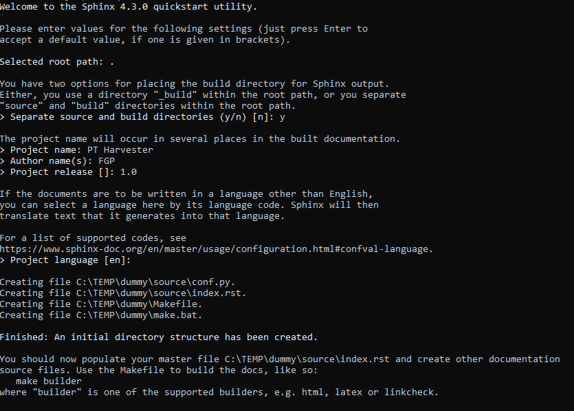

# Gestion de la documentation technique par Sphinx

 - [Introduction](#Introduction)
 - [Package Python](#Package-Python)
 - [Initialisation de l'environnement de départ](#Initialisation-de-l'environnement-de-départ)
 - [Convention de documentation](Convention-de-documentation)
 - [Extraction automatique de la documention FME](Extraction-automatique-de-la-documention-FME)

# Introduction

Ce document décrivant l'utilisation de Sphinx pour la documentation du projet *PT Harverter* est un condensé d'information dédié à donner à l'utilisateur un apperçu rapide des capacités de l'utilitaire Sphinx et de permettre d'accélérer l'appropriation de ce dernier par les membres de l'équipe pour documenter le projet.

Sphinx a été choisi comme outil de documentation car ce dernier permet d'intégrer des documents hétérogènes (markdown, restructuredText, python, html...) et produire automatiquement une documentation intégrée et homogène.  Sphinx produit des pages html statiques accessibles via le web incluant GitHub.

Ci dessous on retrouve différents liens qui vont vous permettre d'approfondir la compréhension de Sphinx:
  * [Site officiel de Sphinx](https://www.sphinx-doc.org/en/master/)
  * [Tutorial sur Sphinx](https://www.sphinx-doc.org/en/master/tutorial/index.html)
  * Deux tutoriels de type *Sphinx for dummies*...
    * [Using Sphinx for Python Documentation](https://shunsvineyard.info/2019/09/19/use-sphinx-for-python-documentation/)
    * [An idiot’s guide to Python documentation with Sphinx and ReadTheDocs](https://samnicholls.net/2016/06/15/how-to-sphinx-readthedocs/)

# Package Python

La documentation technique du projet PT Harvester est maintennue à jour grâce à l'outil de documentation open source Python [Sphinx](https://www.sphinx-doc.org/en/master/).  

Il faut installer les packages Python suivants avec l'utilitaire *pip install* afin de pouvoir initialiser l'environnement de documentation du projet PT Harvester ou regénérer la documentation du projet PT Harvester:

    pip install sphinx 
    pip install sphinx-rtd-theme

Note importante pour l'utilisation de Sphinx
  * Il est suggérer d'utiliser python >= 3.7 
  * On ne doit pas installer le package Sphinx dans l'environnement FME 
  * Il n'est pas nécessaire d'installer l'utilitaire Sphinx pour consulter les pages HTML créés par Sphinx**

# Initialisation de l'environnement de départ

Cette étape a besoin d'être faite qu'une seule fois.  Il ne faut pas la refaire car cette actionviendrait écraser l'initialisation faite précédemment.

Pour créer l'environnement initial de Sphinx

    cd .\répertoire de départ...\
    sphinx-quickstart

Répondre aux questions:

Ajustement du fichier de configuration en ajoutant ou modifiant les lignes suivants dans le fichier conf.py:
 
    # Indiquer où se trouve le code source Python
    sys.path.insert(0, os.path.abspath('../..'))

    # Modifications des extensions
    extensions = ['sphinx.ext.autodoc', 
                  'sphinx.ext.autosummary',
                  'sphinx.ext.coverage', 
                  'sphinx.ext.napoleon',
                  'sphinx.ext.viewcode' ]

    # Création des autosummary
    autosummary_generate = True

    # Nom des classes à usurper 
    autodoc_mock_imports = ["fme", 
                            "fmeobjects",
                            "yaml"]
                        
    # Mettre la documentation Python en ordre alphabétique
    autodoc_member_order = 'alphabetical'
  
    # Utilisation du thème de ReadTheDocs
    html_theme = 'sphinx_rtd_theme'  

    # Ajout du logo du Canada
    html_logo = "_static/Canada.png"

La création de l'environnement Sphinx va aussi créer le fichier make.bat qui servira à mettre à jour la documentation Sphinx.

# Convention de documentation

Dans le cadre du projet PT Harvester, Sphinx est utilisé pour extraire et intégrer automatiquement la documentation des Workbench/Custom Transformer de FME et la documentation des fichiers sources Python.  

Pour ce faire, il est impératif de se conformer aux règles suivantes de documentation:
  * La documentation des Workbench/Custom Transformer de FME doit suivre les conventions décrites dans le document [Documentation FME](DocumentationFME.md);
  * La documentation du code source Python doit se faire dans les docstring *"""Doc string Python""* et suivre la convention de [documentation NumPy](https://numpydoc.readthedocs.io/en/latest/format.html) ([exemple de docstring NumPY](https://realpython.com/documenting-python-code/#numpyscipy-docstrings-example))

# Extraction automatique de la documention FME

Afin de rendre accessible à Sphinx la documentation FME, il faut extraire la description des Workbench/Custom Transformer et créer le répertoire **à venir...** ou chaque fichier correspond à une description d'un Workbench/Custom Transformer en format HTML.

Exécuter la commande: **à venir**

# Mise à jour  et publication de la documentation

La mise à jour de la documentation Sphinx se fait par l'éexécution des commandes suivante qui détruit la documentation existente et la reconstruit par la suite:

    make clean
    make html

La publication de la documentation sur le serveur web GitHub se fait automatiquement en poussant (Push origin) les modifications au contenu du répertoire \fgp-metadata-proxy\FME_files\Python_Docs\* vers la branche master de GitHub.  Il faut attendre une vingtaine de minutes afin de permettre à GitHub de mettre à jour le serveur web et à la nouvelle documentation est disponible par la suite à l'adresse suivante:

    https://federal-geospatial-platform.github.io/fgp-metadata-proxy/FME_files/Python_Docs/build/html/index.html

# Ajout d'un Workbench ou Custom Transformer à la documentation Sphinx

Pour ajouter un nouveau Workbench ou un nouveau Custom Transformer à la documentation on doit créer un nouveau fichier de directives en restructuredText et mettre à jour le fichier restructuredText *index.rst* et créer un nouveau fichier de directives *nom.rst*.

  * Pour ajouter un nouveau fichier restructuredText:
    * Copier le fichier _template.rst sous le nom du workbench ou Custom Transformer que vous voulez créer.
    * Mettre à jour la documention des titres en [restructuredText](https://docutils.sourceforge.io/docs/user/rst/quickref.html);
    * Mettre à jour le nom du fichier .html de la directive Sphinx *..raw:: html*;
    * Mettre à jour les noms des fichiers contenant le code source python pour les directives Sphinx ..autosummary:: et ..automodule:: dans le fichier .rst.  Les sections autosummary et automodule peuvent être enlevé s'il n'y a pas de code source Python à mettre à jour;
    * Ajouter au besoin de l'information supplémentaire en [restructuredText](https://docutils.sourceforge.io/docs/user/rst/quickref.html).
    

