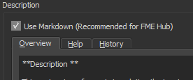

# Gestion de la documentation technique par l'outil Sphinx

 - [Introduction](#Introduction)
 - [Package Python](#Package-Python)
 - [Initialisation de l'environnement de départ](#Initialisation-de-l'environnement-de-départ)
 - [Convention de documentation](Convention-de-documentation)
 - [Extraction automatique de la documention FME](Extraction-automatique-de-la-documention-FME)

# Introduction

Ce document est un condensé d'information dédié à donner à l'utilisateur un apperçu rapide des capacités de l'utilitaire Sphinx à créer et maintenir à jour la documentation du projet *PT Harverter* et de permettre d'accélérer l'appropriation de cet utilitaire de documentation par les membres de l'équipe.

Sphinx a été choisi comme outil de documentation car ce dernier permet d'intégrer des documents hétérogènes (markdown, restructuredText, python, html...) et produire automatiquement une documentation de intégrée, homogène avec une présentation de qualité.  Pour les fins de notre projet, Sphinx produit des pages html statiques accessibles via GitHub sur le web.

Ci dessous on retrouve différents liens qui permettent d'approfondir la compréhension de Sphinx:
  * [Site officiel de Sphinx](https://www.sphinx-doc.org/en/master/)
  * [Tutoriel officiel de  Sphinx](https://www.sphinx-doc.org/en/master/tutorial/index.html)
  * Deux tutoriels de type *Sphinx for dummies*...
    * [Using Sphinx for Python Documentation](https://shunsvineyard.info/2019/09/19/use-sphinx-for-python-documentation/)
    * [An idiot’s guide to Python documentation with Sphinx and ReadTheDocs](https://samnicholls.net/2016/06/15/how-to-sphinx-readthedocs/)

# Package Python

Il faut installer les packages Python suivants avec l'utilitaire *pip install* afin de pouvoir initialiser l'environnement de documentation du projet PT Harvester ou regénérer la documentation du projet PT Harvester:

    pip install sphinx 
    pip install sphinx-rtd-theme
    pip install sphinx-toolbox

Note importante sur l'utilisation de Sphinx
  * Il est suggéré d'utiliser python >= 3.7;
  * On ne doit pas installer le package Sphinx dans l'environnement FME; 
  * Il n'est pas nécessaire d'installer l'utilitaire Sphinx pour uniquement consulter les pages HTML créés par Sphinx** autant sur le web que sur le systeme de fichier.

# Initialisation de l'environnement de départ

**Cette étape a besoin d'être faite qu'une seule fois.**  Il ne faut pas la refaire car cette action viendrait écraser l'initialisation faite précédemment. Dans le cadre du projet PT Harvester, l'initialisation est déjà faite (ce sont les dossiers *build* et *source* dans le dossier *fgp-metadata-proxy\FME_files\Sphinx_Docs*).

Pour créer l'environnement initial de Sphinx:

    cd .\répertoire de départ...\
    sphinx-quickstart

Le fichier sphinx-quickstart.exe se trouve dans le dossier Scripts de l'installation Pyhton. L'emplacement du répertoire de construction de la sortie de Sphinx sera le même que celui où est situé l'exécutable sphinx-quickstart.

Répondre aux questions interactives:

Ajustement du fichier de configuration en ajoutant ou modifiant les lignes suivants dans le fichier conf.py (situé dans le dossier source):
 
    # Indiquer où se trouve le code source Python
    sys.path.insert(0, os.path.abspath('../..'))

    # Modifications des extensions utilisées par Sphinx
    extensions = ['sphinx.ext.autodoc', 
                  'sphinx.ext.autosummary',
                  'sphinx.ext.coverage', 
                  'sphinx.ext.napoleon',
                  'sphinx.ext.viewcode' ]

    # Création des autosummary
    autosummary_generate = True

    # Nom des classes à usurper sinon cela bug
    autodoc_mock_imports = ["fme", 
                            "fmeobjects",
                            "yaml"]
                        
    # Mettre la documentation Python en ordre alphabétique
    autodoc_member_order = 'alphabetical'
  
    # Utilisation du thème de ReadTheDocs
    html_theme = 'sphinx_rtd_theme'  

    # Ajout du logo du Canada
    html_logo = "_static/Canada.png"

La création de l'environnement Sphinx va aussi créer le fichier make.bat qui servira à mettre à jour la documentation Sphinx.

# Convention de documentation

Dans le cadre du projet PT Harvester, Sphinx est utilisé pour extraire et intégrer automatiquement la documentation des Workbench/Custom de FME et la documentation des fichiers sources Python.  

Pour que cet extraction et intégration puisse s'opérer correctement, il est impératif de se conformer aux conventions suivantes de documentation:
  * La documentation des Workbench/Custom Transformer de FME doit suivre les conventions décrites dans le document [Documentation FME](DocumentationFME.md);
  * La documentation du code source Python doit se faire dans les docstring *"""Doc string Python""* et suivre la convention de [documentation NumPy](https://numpydoc.readthedocs.io/en/latest/format.html) ([exemple de docstring NumPY](https://realpython.com/documenting-python-code/#numpyscipy-docstrings-example))

# Extraction automatique de la documention FME

Afin de rendre accessible à Sphinx la documentation FME, il faut extraire la description des Workspaces/Customs. Le programme **reading_FME_description.fmw** du répertoire *fgp-metadata-proxy\FME_files\FME_Workspaces\tools* permet de faire cette tâche. Le fichier *read_fme_description.bat* dans le dossier *fgp-metadata-proxy\FME_files\Sphinx_Docs* lance l'exécution de ce Workspace.

Le répertoire *fgp-metadata-proxy\FME_files\Sphinx_Docs\source\html_FME_Doc* contient un fichier HTML pour chaque Workspace/Custom Transformer. Si aucune information n'est contenue dans l'onglet description du Workbench/Custom Transformers, alors aucun fichier ne sera présent. Le nom du fichiers HTML est le même que celui du Workbench/Custom auquel il se rapporte. Afin d'obtenir une documentation Sphinx dont la mise en forme est uniforme, il est important d'utiliser le language Markdown dans la section *Description* du Custom/Workspace.

L'image suivante montre le fichier *read_fme_description.bat*. On y voit les chemins d'accès relatifs où sont situés les Workspaces/Customs à lire et le répertoire vers lesquel les descriptions en format html seront créées.

# Mise à jour  et publication de la documentation

La mise à jour de la documentation Sphinx se fait par l'exécution des commandes suivante qui détruit la documentation existante et la reconstruit par la suite:

    cd .\répertoire de départ...\
    make clean
    make html

Le résultat de l'exécution de la commande *make html* devrait terminer en affichant:

    build succeeded, XX warnings.
    The HTML pages are in build\html.

Mettre à jour la documentation Sphinx est utile lorsqu'on ajoute de l'information, se référer à la section **Ajout d'un Workbench ou Custom Transformer à la documentation Sphinx** pour plus d'informations.

Dans le cadre du projet PT Harvester, mentionnons qu'il est utile d'ajouter à la variable d'environnement *Path* le chemin d'accès vers l'installation Python où est installé Sphinx. Autrement, il faut s'assurer de copier le nouveau contenu du ficher *build* vers le répertoire GitHub. Ne pas oublier d'insérer dans le répertoire GitHub *source*, les nouveaux fichiers *.rst* créés.

La publication de la documentation sur le serveur web GitHub se fait automatiquement en poussant (Push origin) les modifications contenus dans le répertoire *\fgp-metadata-proxy\FME_files\Sphinx_Docs* vers la branche master du projet dans GitHub.  Il faut attendre une vingtaine de minutes afin de permettre à GitHub de mettre à jour le serveur web afin que la nouvelle documentation soit disponible par la suite à l'adresse suivante sur le web:

    https://federal-geospatial-platform.github.io/fgp-metadata-proxy/FME_files/Sphinx_Docs/build/html/index.html

# Ajout d'un Workbench ou Custom Transformer à la documentation Sphinx

Pour ajouter un nouveau Workbench ou un nouveau Custom Transformer à la documentation on doit créer un nouveau fichier de directives en restructuredText et mettre à jour le fichier restructuredText *index.rst* et créer un nouveau fichier de directives *nom.rst*.

  * Pour ajouter un nouveau fichier restructuredText:
    * Copier le fichier _Template.rst et renommez le avec le nom du Workbench ou Custom Transformer que vous voulez créer.
    * Mettre à jour la documention des titres en [restructuredText](https://docutils.sourceforge.io/docs/user/rst/quickref.html);
    * Mettre à jour le nom du fichier .html de la directive Sphinx *..raw:: html* (voir la section ci-haut **Extraction automatique de la documention FME**);
    * Mettre à jour les noms des fichiers contenant le code source python pour les directives Sphinx ..autosummary:: et ..automodule:: dans le fichier .rst.  Les sections autosummary et automodule peuvent être enlevé s'il n'y a pas de code source Python à mettre à jour;
    * Ajouter au besoin de l'information supplémentaire en [restructuredText](https://docutils.sourceforge.io/docs/user/rst/quickref.html).
    
L'image ci-dessous illustre certaines des étapes dont il est mention ci-haut.

