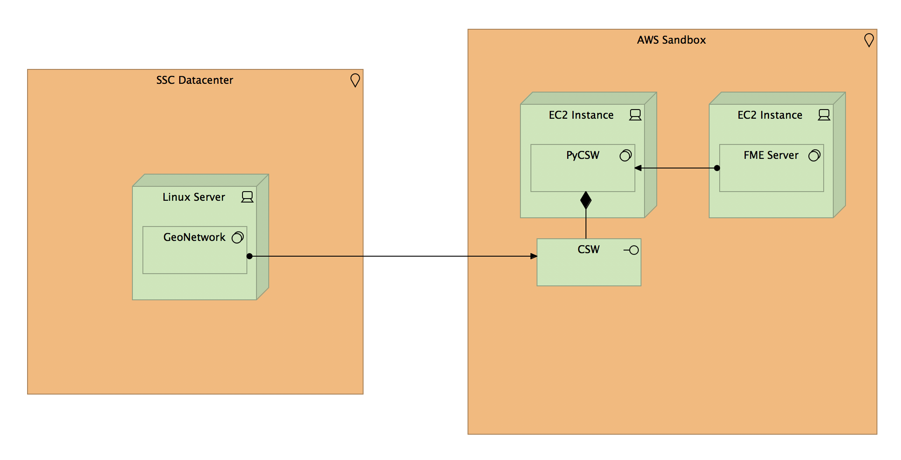
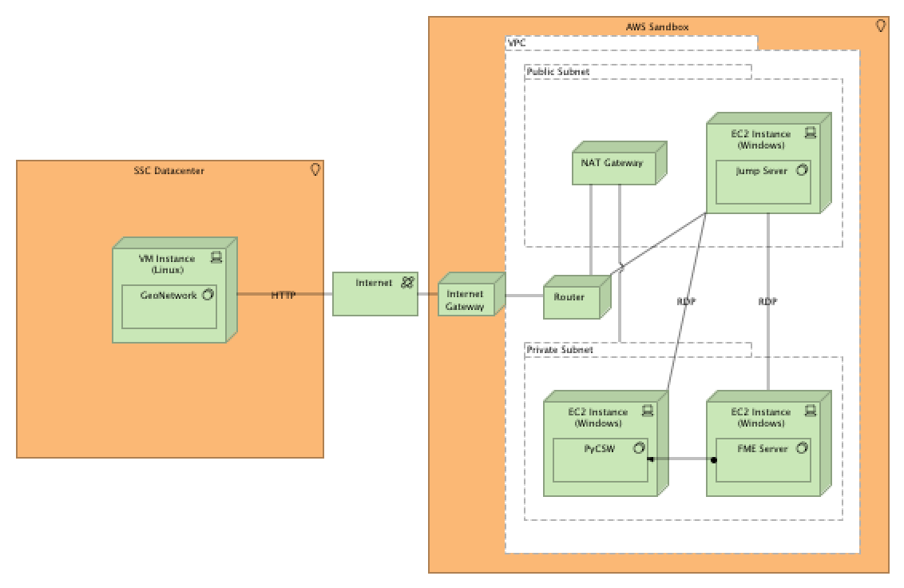

# Architecture

## Solution Concept

The Metadata Proxy facilitates the ingestion of external 3rd party metadata into the Federal Geospatial Platform (FGP) catalogue. Currenty, the FGP catalogue is used to manage internal stakeholder metadata and is purpose built to support platform specfic requirements and standards. These requirements and standards impose unecessary constraints on external metadata resources and makes automated ingestion practically impossible using existing capability.

The Metadata Proxy will provide a suite of software and services designed to facilitate automated ingestion of external metadata into the FGP. The solution will leverage existing systems, API's, and services where possible.

### Principles
* Scalable
* Easy to maintain
* Flexible
* Loosely coupled
* Standards based

### Known Constraints

#### FGP
* OGC CSW Interface (Harvesting)
* Harmonized ISO 19115:2003 / North American Profile Metadata For Government of Canada Geospatial Data (HNAP)
* Publication levels (i.e. Level 1, Level 2)
* MOU between P/T and TBS required for Level 2 publication

#### P/T
* Heterogenous metadata schemas (e.g. ISO, DCAT, etc.)
* Heterogenous API's (e.g. REST, CSW, other, etc..)
* Varying degrees of support for geospatial standards

## Design Decisions

* Cloud deployment (i.e. FGP GeoCommunity Cloud on AWS)
  * Scalable technology stack (e.g. serverless, cloud native)
* Leverage FGP Catalogue internal processes for managing harvest tasks
* Lower the barrier to entry for P/T stakeholders
  * Simplify metadata schema (e.g. adopt DCAT/GeoDCAT)
  * In situ harvesting

## Context

The FGP will be the clearinghouse for geospatial data in the Government of Canada. Any P/T metadata that is harvested into the FGP will published to the Open Data Portal via Open Maps.

_Note that non-geospatial P/T data are currently harvested by the Open Data Portal._

## Deployment

The FGP GeoNetwork

## Resources

[Requirements](https://federal-geospatial-platform.github.io/fgp-metadata-proxy/requirements)

[Data Sources](https://federal-geospatial-platform.github.io/fgp-metadata-proxy/data-sources)

